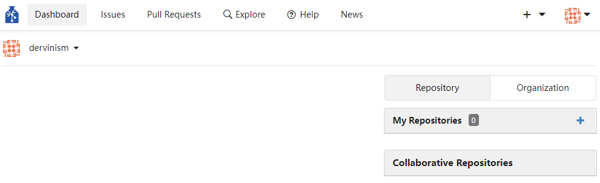
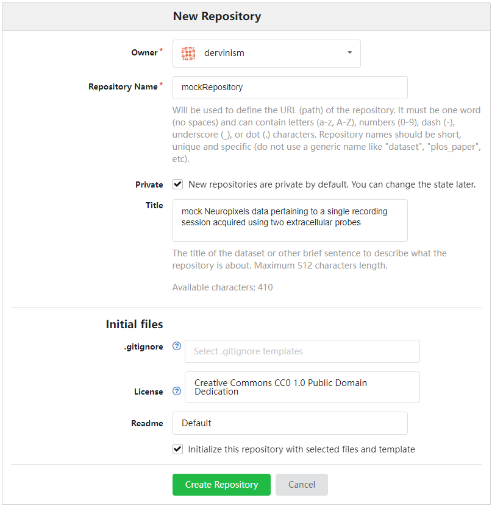
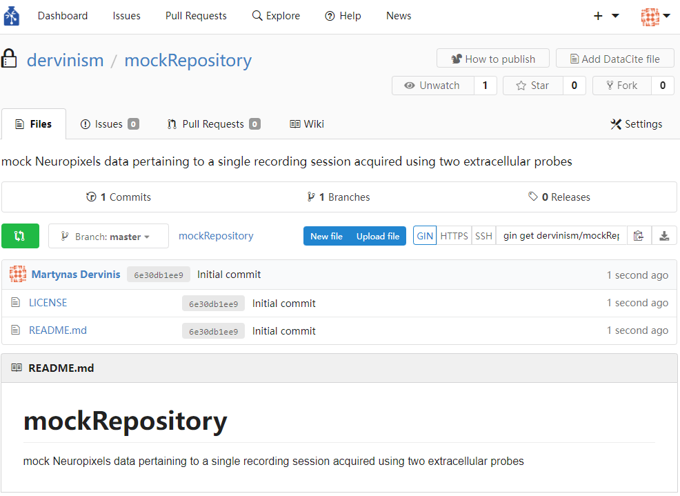
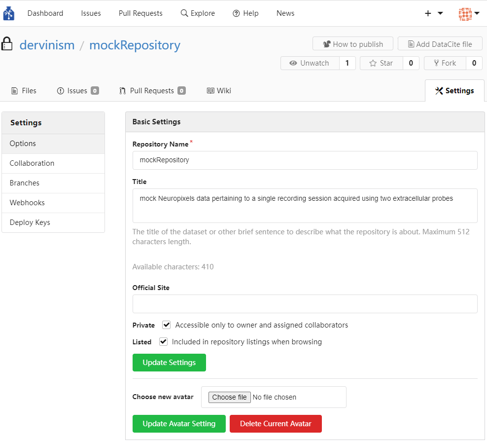
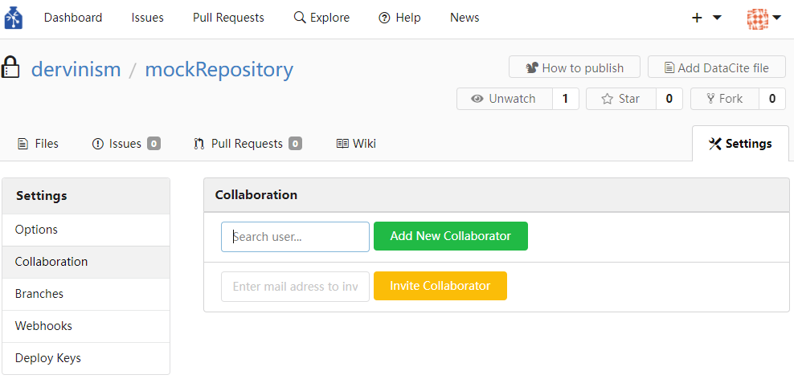
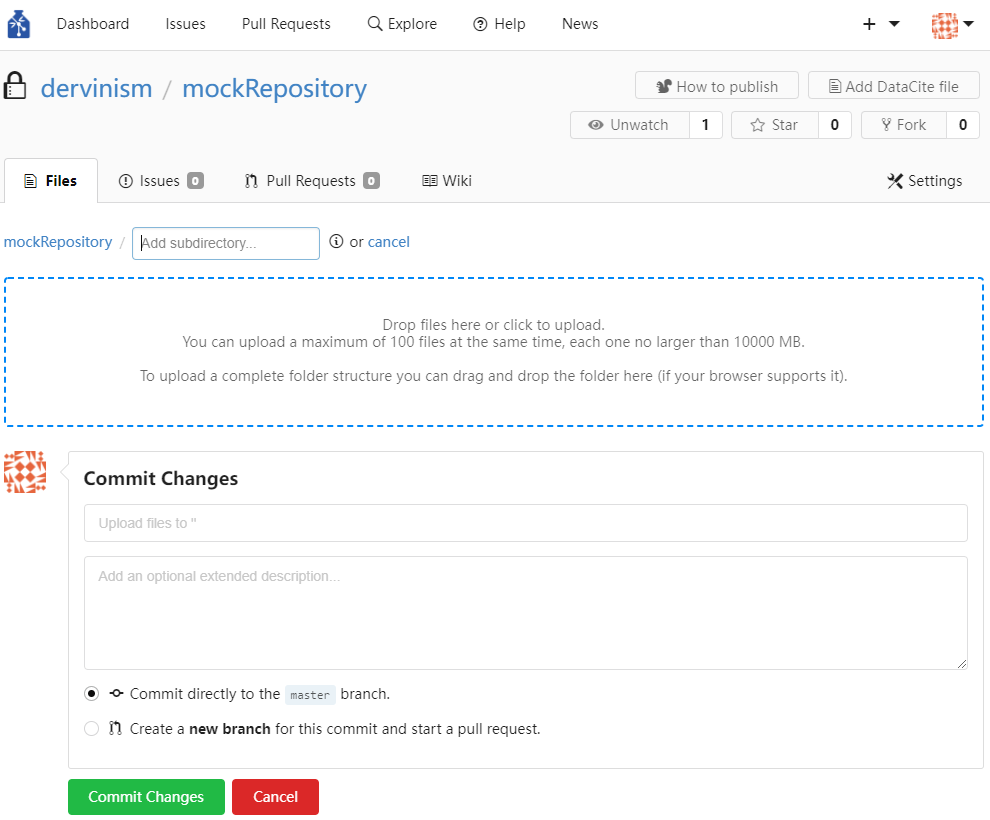
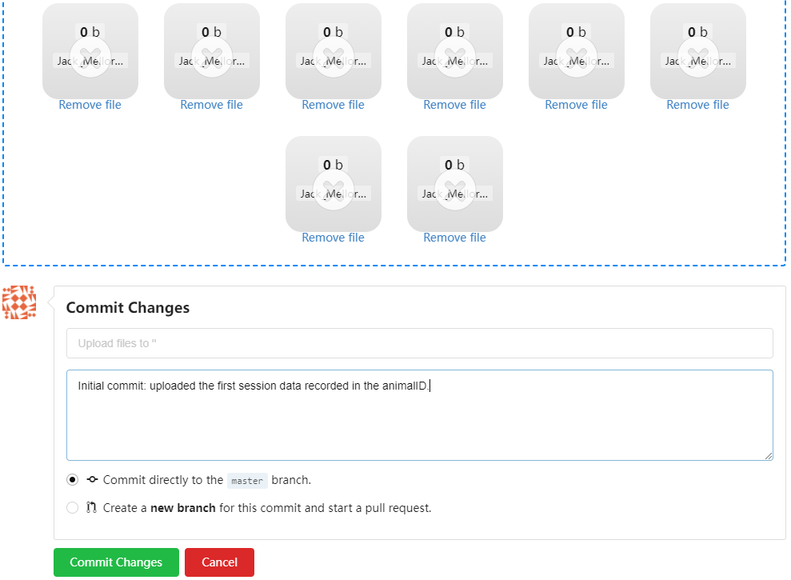

# GIN Web Interface Tutorial

The aim of this tutorial is to give you an introduction to using the GIN web interface. For this tutorial you will need a laptop with an internet connection and [a mock repository](TeamNeuroUoB) downloaded on your computer.

In this tutorial you will learn how to:
1. Create a repository
2. Upload files to a repository
3. Download files from a repository onto your computer
4. Transfer repository ownership to your organisation
5. Create a collaborating team
6. Assign the repository to the team
7. Add members to the team

UoB GIN is currently available only on the UoB intranet. Therefore, we are going to use [the web GIN](https://gin.g-node.org/) instead. This is fine as the two work the same. We start by registering an account with the web GIN. You just need to follow the instructions on the screen and your account is set up. Once the registration is done, you should have an account open as shown in the figure below.

 \
**Figure 1. Fresh account**

&nbsp;

The next step is to create a repository.

 \
**Figure 2. Creating a repository**

&nbsp;

I am going to use mock Neuropixels data acquired during a single recording session using two silicon probes. Below is an example (Figure 3) showing how to enter basic data describing a repository. I am not going to enter anything in the gitignore entry but one can indicate which files and folders of the local instance of the repository should not be synchronised with the remote repository by providing [a gitignore file](https://git-scm.com/docs/gitignore).

 \
**Figure 3. Describing a repository**

&nbsp;

By default the repository is private but it can be changed to public at any time (not yet true for UoB GIN). You can also add collaborators at a later stage. Once the repository is created you should see the page below.

 \
**Figure 4. Fresh repository**

&nbsp;

Once the repository is created its properties can be modified via the Settings pane (Figure 5). Figure below shows part of available settings. More advanced settings can be set up (revealed if you scroll down), as well as collaborators can be added to the repository who can be granted full or restricted access rights (Figure 6).

 \
**Figure 5. Repository settings**

&nbsp;

 \
**Figure 6. Setting up collaborations**

&nbsp;

When we have a repository created and settings adjusted, the next step is to upload research data files. I have created a simple folder structure containing mock data that I would typically generate during a single recording session using two Neuropixels probes and a pupil camera but which also include pre-processing data generated during spike sorting with kilosort and Phy. The files can be uploaded using the blue ‘upload file’ button (Figure 4) which brings the ‘Commit changes’ page (Figure 7). The files can then be uploaded by clicking the area marked by the blue dashed line or by clicking that area. Note that the web interface limits the ammount and the size of files that can be uploaded. The proper more efficient way to manage multiple and large files is to use the GIN command line tools which are covered in [the next tutorial](GIN-client-tutorial.md).

 \
**Figure 7. File upload page**

&nbsp;

In my case I simply drag-and-drop the entire [folder](TeamNeuroUoB) that I have prepared. This mock research data folder contains the following structure: \
dervinism\mock_repository\Jack_Mellor_group\MD\mock_project\animal_ID\session1_2022-05-16\probe1 (all data pertaining to the recording probe 1) \
dervinism\mock_repository\Jack_Mellor_group\MD\mock_project\animal_ID\session1_2022-05-16\probe2 (all data pertaining to the recording probe 2) \
dervinism\mock_repository\Jack_Mellor_group\MD\mock_project\animal_ID\session1_2022-05-16 (data that is related to both recording probes like pupil video, for example). \
I also add a commit message that succinctly describes the change that I am introducing to the repository.

 \
**Figure 8. Committing files to the repository**

&nbsp;

The repository now contains files which can be downloaded by your collaborators or by yourself if you lose access to your local instance of the repository. Just press the download button indicated in Figure 9 to download the entire repository. Files larger than 10MB will not be downloaded and only pointers will be downloaded. Big files have to be downloaded individually. Alternatively, large files can be downloaded using GIN client, git, or gitAnnex (command line tools). To download files individually, simply locate the file within the repository and click the Download button to the right of the file of interest (Figure 10). Similarly, you can delete a file by clicking the button with the bin symbol to the right of the Download button. If the file is a text file it can be edited by pressing the button with the pen symbol. GIN allows creating new text files by pressing the blue New file button (Figure 9). If you give an .md (Markdown) extension to the text file, it will allow you to use rich text editing tools just like in Github. These text editing tools are particularly useful when creating README files. Markdown text editing tools were used to create this tutorial.

 \
**Figure 9. Downloading repositories**

&nbsp;

